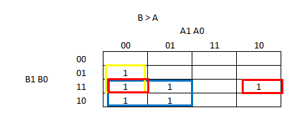
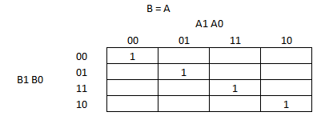
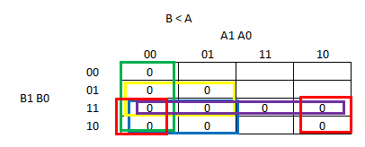

# Laboratórna úloha číslo 2
### *Autor : Daniel Haluška ID:220816 https://github.com/DaNNym99/Digital-electronics-1* 


## 1. Pravdivostná tabuľka:

| **Dec. equivalent** | **B[1:0]** | **A[1:0]** | **B > A** | **B = A** | **B < A** |
| :-: | :-: | :-: | :-: | :-: | :-: |
| 0 | 0 0 | 0 0 | 0 | 1 | 0 |
| 1 | 0 0 | 0 1 | 0 | 0 | 1 |
| 2 | 0 0 | 1 0 | 0 | 0 | 1 |
| 3 | 0 0 | 1 1 | 0 | 0 | 1 |
| 4 | 0 1 | 0 0 | 1 | 0 | 0 |
| 5 | 0 1 | 0 1 | 0 | 1 | 0 |
| 6 | 0 1 | 1 0 | 0 | 0 | 1 |
| 7 | 0 1 | 1 1 | 0 | 0 | 1 |
| 8 | 1 0 | 0 0 | 1 | 0 | 0 |
| 9 | 1 0 | 0 1 | 1 | 0 | 0 |
| 10 | 1 0 | 1 0 | 0 | 1 | 0 |
| 11 | 1 0 | 1 1 | 0 | 0 | 1 |
| 12 | 1 1 | 0 0 | 1 | 0 | 0 |
| 13 | 1 1 | 0 1 | 1 | 0 | 0 |
| 14 | 1 1 | 1 0 | 1 | 0 | 0 |
| 15 | 1 1 | 1 1 | 0 | 1 | 0 |

### 1.1. Funkcie B=A a B<A:


## 2. Karnaughove mapy



### 2.1. Zjednodušená forma SoP B>A funkcie 






### 2.2. Zjednodušená forma PoS B < A funkcie 


### 2.3. Link na edaplayground (2-bit komparátor): https://www.edaplayground.com/x/rnP9

### 2.4. Obrázok výstupu 


## 3. Binárny Komparátor 4-bit

### 3.1. Link na edaplayground (4-bit komparátor): https://www.edaplayground.com/x/7fe3

### 3.2. Súbor design.vhd

```vhdl
library ieee;
use ieee.std_logic_1164.all;

------------------------------------------------------------------------
-- Entity declaration for 4-bit binary comparator
------------------------------------------------------------------------
entity comparator_2bit is
    port(
        a_i              : in  std_logic_vector(4 - 1 downto 0);
        b_i           	 : in  std_logic_vector(4 - 1 downto 0);
        B_greater_A_o    : out std_logic;       -- B is less than A
        B_equals_A_o     : out std_logic;       -- B is less than A
        B_less_A_o       : out std_logic        -- B is less than A
    );
end entity comparator_2bit;

------------------------------------------------------------------------
-- Architecture body for 4-bit binary comparator
------------------------------------------------------------------------
architecture Behavioral of comparator_2bit is
begin

    	B_greater_A_o   <= '1' when (b_i > a_i) else '0';
    	B_equals_A_o    <= '1' when (b_i = a_i) else '0';
    	B_less_A_o      <= '1' when (b_i < a_i) else '0';

end architecture Behavioral;
```
### 3.3. Súbor testbench.vhd

```vhdl
library ieee;
use ieee.std_logic_1164.all;

------------------------------------------------------------------------
-- Entity declaration for testbench
------------------------------------------------------------------------
entity tb_comparator_2bit is
    -- Entity of testbench is always empty
end entity tb_comparator_2bit;

------------------------------------------------------------------------
-- Architecture body for testbench
------------------------------------------------------------------------
architecture testbench of tb_comparator_2bit is

    -- Local signals
    signal s_a       		: std_logic_vector(4 - 1 downto 0);
    signal s_b     		    : std_logic_vector(4 - 1 downto 0);
    signal s_B_greater_A 	: std_logic;
    signal s_B_equals_A  	: std_logic;
    signal s_B_less_A    	: std_logic;

begin
    -- Connecting testbench signals with comparator
    uut_comparator_2bit : entity work.comparator_2bit
        port map(
            a_i           => s_a,
            b_i           => s_b,
            B_greater_A_o 	=> s_B_greater_A,
            B_equals_A_o  	=> s_B_equals_A,
            B_less_A_o    	=> s_B_less_A
        );

    --------------------------------------------------------------------
    -- Data generation process
    --------------------------------------------------------------------
    p_stimulus : process
    begin
        -- Report a note at the begining of stimulus process
        report "Stimulus process started" severity note;

        -- Test values
        s_b <= "0000"; s_a <= "0000"; wait for 100 ns;
        -- Expected output
        assert ((s_B_greater_A = '0') and (s_B_equals_A = '1') and (s_B_less_A = '0'))
        -- If false, then report an error
        report "Test failed for input combination: 0000, 0000" severity error;
        
        -- Test values
        s_b <= "0001"; s_a <= "0000"; wait for 100 ns;
        -- Expected output
        assert ((s_B_greater_A = '1') and (s_B_equals_A = '0') and (s_B_less_A = '0'))
        -- If false, then report an error
        report "Test failed for input combination: 0001, 0000" severity error;
        
        -- Test values
        s_b <= "0001"; s_a <= "0010"; wait for 100 ns;
        -- Expected output
        assert ((s_B_greater_A = '0') and (s_B_equals_A = '0') and (s_B_less_A = '1'))
        -- If false, then report an error
        report "Test failed for input combination: 0001, 0010" severity error;
        
        -- Test values
        s_b <= "0100"; s_a <= "0110"; wait for 100 ns;
        -- Expected output
        assert ((s_B_greater_A = '0') and (s_B_equals_A = '0') and (s_B_less_A = '1'))
        -- If false, then report an error
        report "Test failed for input combination: 0100, 0110" severity error;
        
        -- Test values
        s_b <= "1111"; s_a <= "1100"; wait for 100 ns;
        -- Expected output
        assert ((s_B_greater_A = '1') and (s_B_equals_A = '0') and (s_B_less_A = '0'))
        -- If false, then report an error
        report "Test failed for input combination: 1111, 1100" severity error;
        
        -- Test values
        s_b <= "0110"; s_a <= "1001"; wait for 100 ns;
        -- Expected output
        assert ((s_B_greater_A = '0') and (s_B_equals_A = '0') and (s_B_less_A = '1'))
        -- If false, then report an error
        report "Test failed for input combination: 0110, 1001" severity error;
        
        -- Test values
        s_b <= "0111"; s_a <= "1110"; wait for 100 ns;
        -- Expected output
        assert ((s_B_greater_A = '0') and (s_B_equals_A = '0') and (s_B_less_A = '1'))
        -- If false, then report an error
        report "Test failed for input combination: 0111, 1110" severity error;
        
        -- Test values
        s_b <= "0011"; s_a <= "0011"; wait for 100 ns;
        -- Expected output
        assert ((s_B_greater_A = '0') and (s_B_equals_A = '1') and (s_B_less_A = '0'))
        -- If false, then report an error
        report "Test failed for input combination: 0011, 0011" severity error;
        
        -- Test values
        s_b <= "1000"; s_a <= "0100"; wait for 100 ns;
        -- Expected output
        assert ((s_B_greater_A = '1') and (s_B_equals_A = '0') and (s_B_less_A = '0'))
        -- If false, then report an error
        report "Test failed for input combination: 1000, 0100" severity error;
        
        -- Test values
        s_b <= "1111"; s_a <= "1111"; wait for 100 ns;
        -- Expected output with error (s_B_equals_A = '1')
        assert ((s_B_greater_A = '0') and (s_B_equals_A = '0') and (s_B_less_A = '0'))
        -- If false, then report an error
        report "Test failed for input combination: 1111, 1111" severity error;
        
        -- Report a note at the end of stimulus process
        report "Stimulus process finished" severity note;
        wait;
    end process p_stimulus;

end architecture testbench;
```
### 3.4. Umelo vytvorený error v konzole 

```vhdl
[2021-02-18 11:17:14 EST] ghdl -i design.vhd testbench.vhd  && ghdl -m  tb_comparator_2bit && ghdl -r  tb_comparator_2bit   --vcd=dump.vcd && sed -i 's/^U/X/g; s/^-/X/g; s/^H/1/g; s/^L/0/g' dump.vcd 
analyze design.vhd
analyze testbench.vhd
elaborate tb_comparator_2bit
testbench.vhd:51:9:@0ms:(report note): Stimulus process started
testbench.vhd:112:9:@1us:(assertion error): Test failed for input combination: 1111, 1111
testbench.vhd:117:9:@1us:(report note): Stimulus process finished
Finding VCD file...
./dump.vcd
[2021-02-18 11:17:15 EST] Opening EPWave...
Done
```
### 3.5. Obrázok výstupu 

